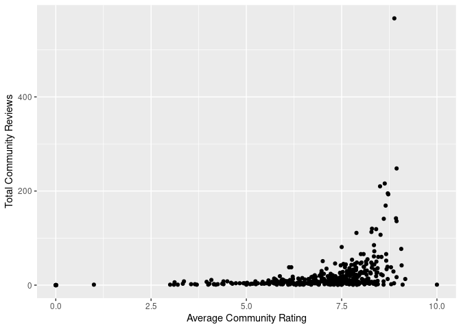
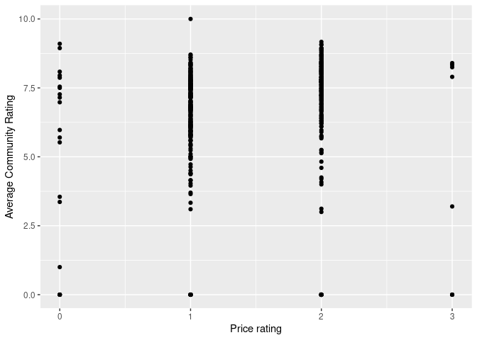
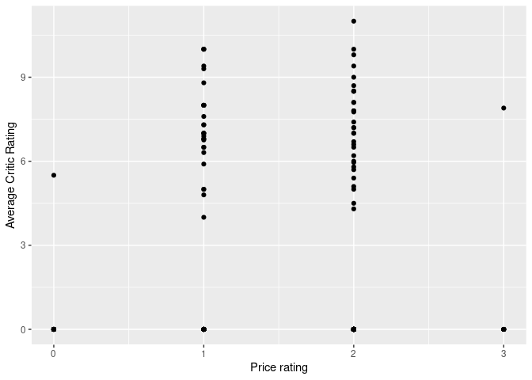

Project
================
Caeden Kullander
2025-03-16

## 1. Introduction

pizza_barstool is a dataset about pizza places and their reviews. I
found it on TidyTuesday. It pulls data from the “One Bite” app. This
data includes review information from critics and the public, as well as
location and price rating information. I want to explore the
relationships between location, price ratings, community reviews, critic
reviews, and number of reviews and how these are correlated with each
other. Specifically, I want to know how much community reviews differ
from critic reviews, and how location and price impact these
correlations.

## 2. Data

    ## 
    ## Attaching package: 'dplyr'

    ## The following objects are masked from 'package:stats':
    ## 
    ##     filter, lag

    ## The following objects are masked from 'package:base':
    ## 
    ##     intersect, setdiff, setequal, union

    ## Rows: 463
    ## Columns: 22
    ## $ name                                 <chr> "Pugsley's Pizza", "Williamsburg …
    ## $ address1                             <chr> "590 E 191st St", "265 Union Ave"…
    ## $ city                                 <chr> "Bronx", "Brooklyn", "New York", …
    ## $ zip                                  <int> 10458, 11211, 10017, 10036, 10003…
    ## $ country                              <chr> "US", "US", "US", "US", "US", "US…
    ## $ latitude                             <dbl> 40.85877, 40.70808, 40.75370, 40.…
    ## $ longitude                            <dbl> -73.88484, -73.95090, -73.97411, …
    ## $ price_level                          <int> 1, 1, 1, 2, 2, 1, 1, 1, 2, 2, 1, …
    ## $ provider_rating                      <dbl> 4.5, 3.0, 4.0, 4.0, 3.0, 3.5, 3.0…
    ## $ provider_review_count                <int> 121, 281, 118, 1055, 143, 28, 95,…
    ## $ review_stats_all_average_score       <dbl> 8.011111, 7.774074, 5.666667, 5.6…
    ## $ review_stats_all_count               <int> 27, 27, 9, 2, 1, 4, 5, 17, 14, 6,…
    ## $ review_stats_all_total_score         <dbl> 216.3, 209.9, 51.0, 11.2, 7.1, 16…
    ## $ review_stats_community_average_score <dbl> 7.992000, 7.742308, 5.762500, 0.0…
    ## $ review_stats_community_count         <int> 25, 26, 8, 0, 0, 3, 4, 16, 13, 4,…
    ## $ review_stats_community_total_score   <dbl> 199.8, 201.3, 46.1, 0.0, 0.0, 13.…
    ## $ review_stats_critic_average_score    <dbl> 8.8, 0.0, 0.0, 4.3, 0.0, 0.0, 0.0…
    ## $ review_stats_critic_count            <int> 1, 0, 0, 1, 0, 0, 0, 0, 0, 1, 0, …
    ## $ review_stats_critic_total_score      <dbl> 8.8, 0.0, 0.0, 4.3, 0.0, 0.0, 0.0…
    ## $ review_stats_dave_average_score      <dbl> 7.7, 8.6, 4.9, 6.9, 7.1, 3.2, 6.1…
    ## $ review_stats_dave_count              <int> 1, 1, 1, 1, 1, 1, 1, 1, 1, 1, 1, …
    ## $ review_stats_dave_total_score        <dbl> 7.7, 8.6, 4.9, 6.9, 7.1, 3.2, 6.1…

## 3. Data analysis plan

To answer my questions, I plan to use the variables for average scores
for critics and community. I plan to compare visualisations between the
two, and also filter/mutate for specific geographical areas to see how
ratings compare in various locations.

Does the number of reviews correlate with the average review score?

<!-- -->

There is certainly some correlation there, but this display shows that
many of the restaurants have very few reviews.

How does price level correlate with community ratings and critic
ratings? How are the correlations different?
<!-- -->

<!-- -->

The two are surprisingly similar, with very little notable difference.
